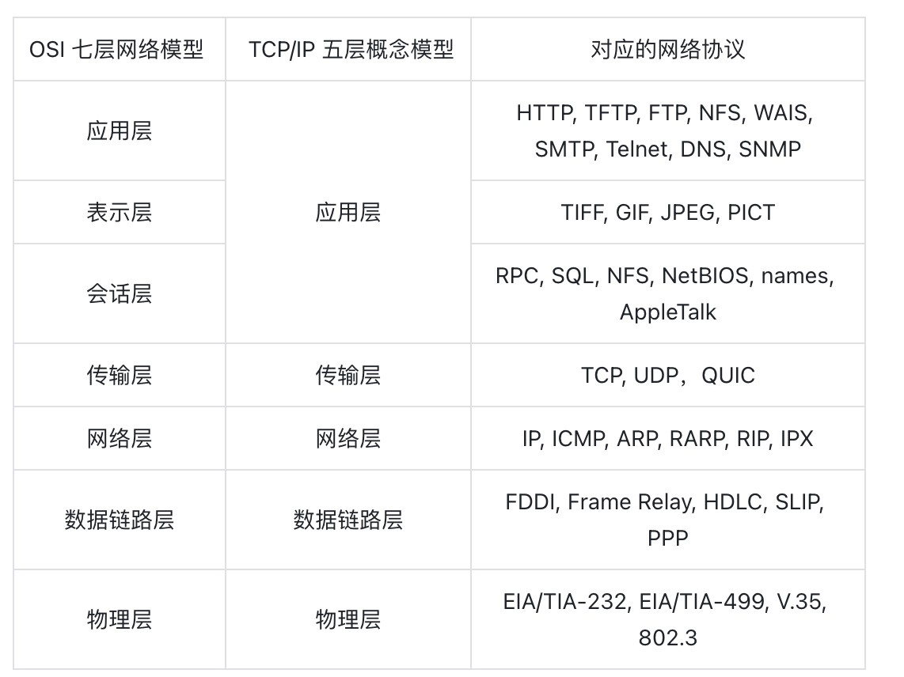
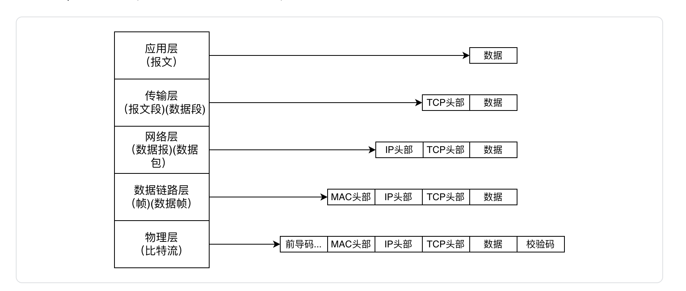
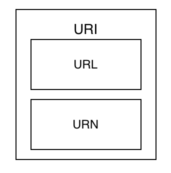
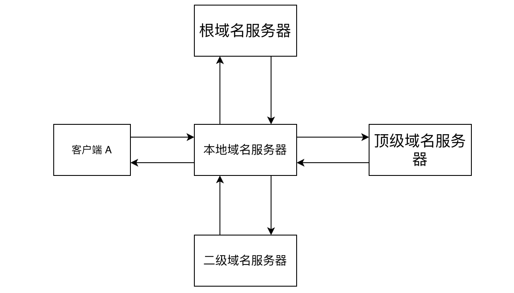
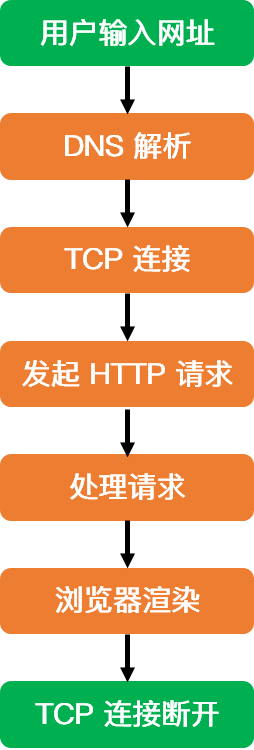

## 第一部分：计算机网络体系结构

因特网是极为复杂的系统,它包含大量的软件以及硬件系统,大量的应用程序和协议、各种类型的端系统、分组交换机,面对这种庞大且复杂的系统,将其化简分层是极其有必要的,分层的好处如下：

    1. 各层之间相互独立、相关隔离。每层只考虑当前层如何实现，无需考虑其他层
    2. 提高整体结构的灵活性，层次之间结构解耦合
    3.大问题变小，复杂问题变简单


本章高频面试题

    1. 计算机网络为什么要分层？
    2. 计算机网络是怎么分层的？
    3. 三种计算机网络模型的关系是什么？每一层分别包含哪些协议？
    4. 计算机网络中，数据如何在各层中传播？数据在网络各层中的存在形式是怎么样的？

### 1.1 OSI七层模型

OSI(Open System Interconnection Reference Model) 模型是国际标准化组织 ISO（International Organization for Standardization) 提出的一个试图使各种计算机在世界范围内互连为网络的标准框架。
OSI 将计算机网络体系结构划分为七层，每一层实现各自的功能和协议，并完成与相邻层的接口通信。OSI 的服务定义详细说明了各层所提供的服务。

    1. 应用层：通过应用程序间的交互来完成特定的网络应用
    2. 表示层：解释交换数据的含义。该层提供的服务主要包括数据压缩，数据加密以及数据描述。
    3. 会话层：负责建立、管理和终止表示层实体之间的通信会话。该层提供了数据交换的定界和同步功能，包括了建立检查点和恢复方案的方法。
    4. 传输层：负责因特网中两台主机的进程提供通信服务。
    5. 网络层：选择合适的网间路由和交换节点，确保数据按时成功传送。
    6. 数据链路层(链路层)：数据链路层将网络层交下来的 IP 数据报组装成帧，在两个相邻节点间的链路上传送帧。
    7.物理层：实现计算机节点之间比特流的透明传送，尽可能屏蔽掉具体传输介质和物理设备的差异。该层的主要任务是确定与传输媒体的接口的一些特性（机械特性、电气特性、功能特性，过程特性）

## 1.2 TCP/IP五层参考模型

五层体系的协议结构是综合了 OSI 和 TCP/IP 优点的一种协议，包括应用层、传输层、网络层、数据链路层和物理层。其中应用层对应 OSI 的上三层，下四层和 OSI 相同。五层协议的体系结构只是为介绍网络原理而设计的，实际应用还是 TCP/IP 四层体系结构。

    1. 应用层 ：为特定应用程序提供数据传输服务。
    2. 传输层 ：为进程提供通用数据传输服务。
    3. 网络层 ：为主机提供数据传输服务。而传输层协议是为主机中的进程提供数据传输服务。
    4. 数据链路层 ：网络层针对的还是主机之间的数据传输服务，而主机之间可以有很多链路，链路层协议就是为同一链路的主机提供数据传输服务。
    5. 物理层 ：负责比特流在传输介质上的传播。

## 1.3 两种模型对比




### 1.4 数据如何在各层直接传输

    面试难度：🌟🌟🌟 面试考核频率： 🌟🌟🌟🌟



假设一个主机上的一个应用向另一个主机的一个应用发送数据。

    1.在发送主机端，一个应用层报文被传送到传输层。在最简单的情况下，传输层收取到报文并附上附加信息，该首部将被接收端的传输层使用。
    2.应用层报文和传输层首部信息一道构成了传输层报文段。附加的信息可能包括：允许接收端传输层向上向适当的应用程序交付报文的信息以及差错检测位信息。该信息让接收端能够判断报文中的比特是否在途中已被改变。
    3.传输层则向网络层传递该报文段，网络层增加了如源和目的端系统地址等网络层首部信息，生成了网络层数据报文。
    4.该数据报文接下来被传递给链路层，在数据链路层数据包添加发送端 MAC 地址和接收端 MAC 地址后被封装成数据帧。
    5.在物理层数据帧被封装成比特流，之后通过传输介质传送到对端。而在接收主机端，整个过程正好反过来。

## 第二部分：应用层

网络应用是计算机网络存在的理由，而网络应用都是处于应用层的，所以应用层是计算机网络中最重要的部分之一。

本章高频面试题

    1. uri 和 url 的区别 ？
    2. dns 是啥工作原理，主要解析过程是啥？
    3. 用户输入网址到显示对应页面的全过程是啥？
    4. http 头部包含哪些信息？
    5. http 方法了解哪些？
    6. http 状态码了解哪些？
    7. get 和 post 的区别？
    8. https 和 https 的区别？
    9. https 的加密方式？
    10. http 是不保存状态的协议,如何保存用户状态？
    11. http 不同版本的区别？

### 2.1 万维网和域名系统

万维网 (WWW，World Wide Web)，通常称为 Web，是一种信息系统，使文档和其他 Web资源能够通过 Internet 访问。

#### 2.1.1 网络资源

    面试难度：🌟 面试考核频率：🌟🌟🌟🌟🌟

网络上的资源必须有一个唯一的表示，才可以在网络上被访问。

    uri(uniform resource identifier) 统一资源标识符。
    url(uniform resource location) 统一资源定位符，统指绝对路径。
    urn(uniform resource name) 统一资源名。

三者之间关系为， url 和 urn 分别是 URI 的子集 。



其中 URN 还处于实验阶段，未大范围进行使用，目前使用最多的是 url。url 由三部分组成。

    1. 方案，一般是访问资源使用的协议类型，比如http://、https://。
    2. 服务器的 web 地址，可以为域名或者 ip 地址 + 端口号，比如 localhost:8080 或者 127.0.0.1:8080。不添加默认为 80 ，这是访问域名不用加端口号的原因 。
    3. web 服务器上的某个资源，比如leetbook/read/networks-interview-highlights

注意：	`url`是否以`/`结尾，意义是不同的，用户无感知的原因是因为服务器自动处理了这种差异。

#### 2.1.2 应用程序体系架构

    面试难度：🌟 面试考核频率：🌟🌟

应用程序体系体系架构主要分为两种。

    1. C/S(client/server) ：客户端之间不进行通信，客户端向服务端发送请求获取数据，服务器要一直开机，需要配备大量的数据中心。比如：微信，google，bing等等。
    2. P2P(peer to peer) ：对等通信，不需要数据中心，没有客户端和服务端的区别，应用程序在间断连接的主机对之间直接通信。主要应用在流量密集型应用。比如：迅雷，bitTorrent，或者在局域网的文件内部共享应用中。

目前大型互联网应用主要采用的是 C/S 架构，导致 P2P 架构逐渐被人遗忘。 C/S 架构又可以细分为 C/S(client/server) 和 B/S(browser/server)，即根据客户端类型划分。

    1. 本地客户端：速度快，安全，灵活性较高，但是开发成本就高，比如游戏客户端。
    2. 浏览器：不需要安装，依托于浏览器，安全性较低，成本极低。

目前很多应用既可以通过本地客户端访问也可以通过浏览器使用。比如，微信，outlook等等。

#### 2.1.3 web的结构组件

    面试难度：🌟🌟🌟 面试考核频率：🌟🌟🌟

web 是极为复杂的，不仅只有 client 与 server 之间简单的请求响应 ，还包含了一些特殊的 server ，他们承担着一些特殊的作用。

    1. 代理：位于客户端和服务器之间的 http中间实体。
       出于安全考虑，通常会将代理做为转发所有 Web 流量的可信任中间节点使用，可以对请求和响应进行过滤。比如，校园网中可以过滤一些不健康的内容，禁止学生进行访问。
    
    2. 网关：连接其他应用程序的特殊 web 服务器。
       作为其他服务器的中间实体使用。常用于将 http 流量转化为其他的协议。网关接受请求时就好像自己本身是资源源服务器一样，客户端对此无感知。
    3. 隧道： 对 http通信报文进行盲转发的特殊代理。
       对两条连接之间的数据进行盲转发，https就是通过隧道实现的。http连接承载加密的安全套接字层`(ssl,secure sockets layer)流量，这样 ssl 流量就可以直接穿过只允许 web 流量通过防火墙，反正亦然。


#### 2.1.4 dns域名系统

    面试难度：🌟🌟🌟 面试考核频率：🌟🌟🌟🌟🌟

域名系统 (dns,domain name system) 是 Internet 或其他 Internet 协议（ip） 网络中计算机、服务和其他资源的分层分布式命名系统。它将各种信息与分配给每个关联实体的域名相关联。最重要的是，它将容易记忆的域名转换为数字ip地址，用于定位和识别具有底层网络协议的计算机服务和设备。

##### 2.1.4.1 dns的作用

在dns 出现之前，互联网中某台主机的唯一标识是这台机器的 ip 地址，但是这种方式记起来很麻烦，人们更喜欢便于记忆的名称。为了解决这个问题，人们需要一种从主机名称到 ip 地址转换的服务，域名系统作为将域名和 ip 地址相互映射的一个分布式数据库，能够使人更方便地访问互联网。

    小提示：dns域名支持中文字符

##### 2.1.4.2 dns 服务器的结构

dns域名的结构是 xxx.xxx.xxx，是分层的。分为顶级域名（一级域名），二级域名，三级域名 . 

顶级域名会根据国家地区，或者组织进行划分,比如cn（代表中国）、edu（代表教育组织）。二级域名就是在顶级域名前面加前缀,比如 leetcode.cn。也正因为如此，dns服务器的结构是树状的。

域名以及服务器结构


注意：映射关系为根域名服务器管理顶级域名，顶级域名服务器管理二级域名，权威域名服务器管理日常使用的网址映射记录。

##### 2.1.4.3 dns 的原理

以一个例子来了解 dns 的工作原理。

假设一个客户端 A，想要查询 a.leetcode.cn 的 ip 地址，考虑缓存的情况。

    1. 客户端 A 首先查询本地 hosts 文件，查询是否有网址映射关系，如果无，进行下一步查找。
    2. 查找本地的 dns 解析器缓存，如果没有进行下一步。
    3. 根据 tcp/ip 参数查找设置好的首选 dns 服务器 ip 地址，一般叫做本地 dns 服务器，查询本地 dns 服务器。本地 dns 服务器如果没有，它就会进行下一步操作。
    4. 本地dns会访问根服务器 ，然后根据后缀名，从根服务器中查找对应的顶级域名服务器的 ip ，然后以此向下查找域名服务器的 ip ，然后查找网址映射关系,直到找到为止。



客户端 A 向本地域名服务器查询为递归查询，本地域名服务器向根域名服务器查询为迭代查询。

##### 2.1.4.4 `dns` 数据传输

dns 的数据传输是采用 tcp 协议还是 udp 协议 ，或者是其他的什么协议 ？

dns 既采用 udp 协议也采用 tcp 协议:

```
1. dns 是通过 53 端口进行通信，默认是采用 udp 协议进行数据传输的，除了个别情况，也就是说绝大多数情况是采用 udp 进行传输。
2. 使用 tcp 传输的情况:
  - 当返回的响应超过的 512 字节（ udp 最大只支持 512 字节的数据）。
  - 区域传送：主域名服务器向辅助域名服务器传送变化的那部分数据。
```

注意: tcp 协议和 tcp 协议是可以同时绑定同一个端口的。
区域传输: dns 服务器中数据不总是一成不变的，域名数量是不断增加，而且一些域名对应着的服务器的也是在变化的，所以其实 dns 服务器中的数据是不断增加的，并且随时流动的，所以可以将区域传输简单理解为 dns 服务器之间进行的数据传输。

##### 2.1.4.5 dns 域名服务器名称概念

    1. 根域名服务器：最高层次的域名服务器，所有的根域名服务器都知道所有的顶级域名服务器的ip地址，全球有 13 个根域名服务器。
    2. 顶级域名服务器：负责处理所有顶级域名，提供到权威域服务器的映射。
    3. 授权(权威)域名服务器：提供主机名到 IP 地址间的映射服务
    4. 主域名服务器：一个或多个区域域名解析工作的主要域名服务器，通常也是一个或多个区域的授权域名服务器。
    5. 辅助域名服务器：协助主域名服务器提供域名查询服务，在主机很多的情况下，可以有效分担主域名服务器的压力。当主域名服务器故障时，辅助域名服务器能够在数据有效期内继续为主机提供域名解析服务。

2.1.5 网页解析全过程

    面试难度：🌟🌟🌟 面试考核频率：🌟🌟🌟🌟🌟
    该节为常见面试题，但是涉及细节内容遍布全书，详解请通读全书，这里内容只涉及应用层和传输层部分内容。



1. dns 解析：访问一个网站时，浏览器获得一个域名，通过 dns 服务将域名解析为 ip 地址。
2. tcp 连接：向 Web 服务器发起 tcp 连接请求。
3. 发送 http 请求：浏览器向 Web 服务器发起一个 http 请求，http 协议是建立在 tcp 协议之上的应用层协议，其本质是在建立起的 tcp连接中，按照 http 协议标准发送一个索要网页的请求。
4. 处理请求并返回：服务器获取到客户端的 http 请求后，会根据 http 请求中的内容来决定如何获取相应的文件，并将文件发送给浏览器。
5. 浏览器渲染：浏览器根据响应开始显示页面，先解析 html 文件构建 DOM 树，然后解析 CSS 文件构建渲染树，等到渲染树构建完成后，浏览器开始布局渲染树并将其绘制到屏幕。
6. 断开连接：客户端和服务器断开连接。


